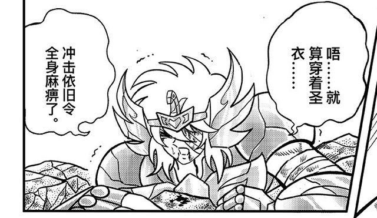
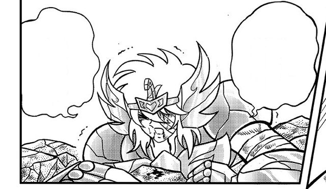
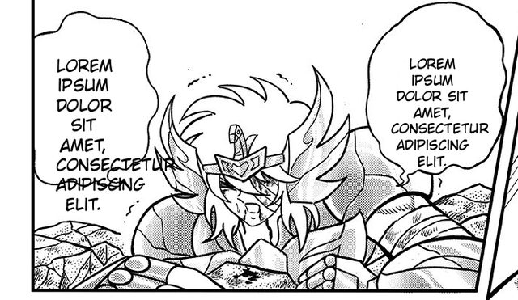

# manga-translator-ptbr

Turns manga / doujinshi / art-book page scans into layered Photoshop PSDs or
GIMP XCFs:
the original text erased cleanly, and an editable Photoshop paragraph text
box already sitting over each speech bubble, caption or block of print —
either holding placeholder text for a human letterer, or pre-filled with a
Brazilian Portuguese translation written by the agent. No more hand-drawing
a Type tool box over every bubble before you can start lettering: open the
PSD and start typing.

The agent-facing instructions are in [SKILL.md](SKILL.md); this file is the
human overview. Everything runs from the repo root (`<repo>`), using the
shared `venv/` and this skill's own `node_modules/` (ag-psd, canvas, pngjs)
and `models/` (ONNX detector + LaMa); `<repo>/setup.sh` creates the venv and
runs this skill's `setup.sh` for the rest. PSDs are written with [ag-psd](https://github.com/Agamnentzar/ag-psd);
XCFs, with native GIMP text layers, by headless flatpak GIMP 3.

## Output: what's in the PSD / XCF

- **Layer "Original"** (bottom) — the untouched scan, for reference or to
  restore anything the cleaning step damaged.
- **Layer "Copy"** — the same page with the detected text erased, and only
  text: stroke detections are gated by the model's own text-block boxes and
  text-line map, so stroke-like false positives on art (decorative borders,
  hatching, screentone) stay untouched. Each erased region is filled with
  the predominant color around it: an exact sampled solid color when the
  surroundings are one plain color (white/black bubbles, grey caption boxes,
  colored banners, ...), or AI-inpainted with LaMa (Photoshop-generative-fill
  style) when the text sits over artwork. Inpainted areas are imperfect by
  nature — restoration of anything worth keeping is manual, by copying from
  the Original layer.
- **One native text layer per text block** (top) — in a PSD a real, editable
  Photoshop **paragraph text box** (the Paragraph Type tool: a fixed
  word-wrap box, not the auto-sizing Point Type); in an XCF a GIMP text
  layer in fixed-box mode. Positioned and sized to match that block. Set in **CCWildWords-Regular** (a manga/comic lettering
  font); holds "Lorem ipsum" placeholder text in the placeholder mode, or
  the PT-BR translation (with per-block rotation, colour, size and
  alignment) in the translate mode.

Every page gets a PSD even if nothing was detected (two identical raster
layers, no text boxes), so a whole folder converts completely in one pass.

### Example (placeholder mode)

The same panel through the three layers, bottom to top:

| Original                                                  | Copy (cleaned)                                          | + Photoshop text boxes                                     |
| --------------------------------------------------------- | ------------------------------------------------------- | ---------------------------------------------------------- |
|  |  |  |

## Three modes

| Mode | Input | Who writes the text | Review of the boxes | Typical use |
| --- | --- | --- | --- | --- |
| **C — placeholder** | folder of raw pages | nobody (Lorem ipsum) | none, fully automatic | prep for a human letterer/translator |
| **B — translate** | raw pages of any size (verified on 7008×10208 scans with 6 pt print, and a 117-page art book) | the agent, reading the page | agent reviews a numbered overlay, merges Japanese columns into paragraphs, drops/adds/re-cuts boxes | translated PSDs straight from scans |
| **A — fill** | PSDs that already have placeholder boxes | the agent, from the English scanlation and/or the Japanese raw embedded in the PSD | n/a | finishing PSDs made by mode C (or by hand) |

Mode C is what the old standalone `manga-letterer` skill did; it now lives
here as the "no translation" path of the same toolchain.

### How the pipeline works

1. **Detect** — [comic-text-detector](https://github.com/dmMaze/comic-text-detector)
   (ONNX, local, no network) finds text strokes and text regions. Mode C
   runs it at page scale (`detect_text.py`, erasing everything the gate
   accepts); Mode B runs it on overlapping tiles as well (`detect_blocks.py`)
   so tiny print on huge scans is found, then `merge_columns.py` unions the
   per-column / per-line boxes into paragraph-sized blocks.
2. **Erase** — every stroke component inside a text block is solid-filled
   with the sampled surrounding colour when the ring around it is uniform,
   or inpainted with LaMa (`inpaint_lama.py`, ONNX from
   [Carve/LaMa-ONNX](https://huggingface.co/Carve/LaMa-ONNX); OpenCV Telea
   fallback) otherwise. Mode B does this only inside the *final* reviewed
   boxes (`clean_blocks.py`), resumable with a time budget.
3. **Build the file** — `build_translated_psd.mjs` writes Original + Copy +
   one paragraph Type layer per block in a single pass (`--placeholder` for
   mode C); GIMP's PSD exporter rasterizes text layers, which is why ag-psd
   writes the `TySh` records itself. `build_translated_xcf.py` takes the
   same arguments and drives headless GIMP (`gimp_xcf_job.py`) to write an
   XCF with native GIMP text layers instead; `FORMAT=xcf` on the round
   scripts picks it. PSD is the default and what the agent delivers unless
   GIMP/XCF is asked for explicitly.
4. **Verify and preview** — `verify_translated_psd.mjs` (per page),
   `validate_psds.mjs` (whole folder), `preview_psd_text.py` (approximate
   render of the boxes over the page for a visual check).

## Scripts

| Script | Role |
| --- | --- |
| `scripts/detect_text.py` | page-scale text detection + erase → cleaned page, mask, overlay, JSON (mode C; also the constants/model path `clean_blocks.py` reuses) |
| `scripts/inpaint_lama.py` | LaMa ONNX inpainting module (used by `detect_text.py` and `clean_blocks.py`) |
| `models/` | `comictextdetector.pt.onnx` + `lama_fp32.onnx`, downloaded by `setup.sh` (gitignored) |
| `package.json` | this skill's Node deps (`node_modules/` gitignored) |
| `setup.sh` | downloads the models, `npm install`, checks for flatpak GIMP |
| `scripts/detect_blocks.py` | tiled block detection for scans of any size, no erasing (mode B) |
| `scripts/merge_columns.py` | merges vertical columns / stacked lines into paragraph blocks, numbered overlay |
| `scripts/overlay_tiles.py`, `scripts/block_sheets.py`, `scripts/page_views.py` | review aids: zoomed gridded tiles, per-block contact sheets, page strips with rulers |
| `scripts/assemble_translation.py` | merged blocks + `tr/<stem>.json` (overlay coords) → final blocks json (page px) |
| `scripts/merge_translations.py` | single-page variant: detect json + translation json → blocks json |
| `scripts/clean_blocks.py` | erases inside the final boxes only, LaMa with `--budget`, resumable |
| `scripts/ensure_upright.py` | recreates the EXIF-rotated source PNG a blocks json points to |
| `scripts/build_translated_psd.mjs` | source + blocks json → PSD (Original, Copy or `--copy-image`, Text N; `--placeholder`) |
| `scripts/build_translated_xcf.py` + `scripts/gimp_xcf_job.py` | same inputs → `.xcf` with native GIMP text layers (fixed box, font, size, colour, rotation), verified by reloading, optional GIMP-rendered preview |
| `scripts/verify_translated_psd.mjs` | per-page check: layers, pixels identical to source, texts present |
| `scripts/validate_psds.mjs` | folder check: Original + Copy, expected Text count, no empty boxes, Lorem ipsum policy |
| `scripts/preview_psd_text.py` | approximate JPG preview of a PSD's text boxes |
| `scripts/list_layers.mjs`, `scripts/list_text_layers.mjs` | dump a PSD's layers (all / text only) as JSON |
| `scripts/export_layer.mjs` | export one raster layer of a PSD to PNG |
| `scripts/set_text_layers.mjs` | replace the text of existing text layers byte-exactly (mode A) |
| `scripts/add_and_fill_text_layers.mjs` | add boxes with final text in one write (race-free on flaky mounts) |
| `scripts/scan_placeholders.mjs` | report text layers still holding Lorem ipsum |
| `scripts/annotate_text_boxes.py` | draw numbered layer boxes over a page for eyeballing indices |
| `scripts/build_two_source_psd.mjs` | Japanese + Portuguese rasters + placeholder boxes in one PSD (batch) |
| `scripts/run_letter_round.sh` | resumable mode C over a folder (`SRC=… OUT=…`, re-run until `ALL DONE`) |
| `scripts/run_detect_round.sh`, `scripts/run_build_round.sh` | resumable mode B rounds: detect+merge, then assemble+clean+build+verify |
| `scripts/run_apply_round.sh` | resumable mode A: apply `translations/<stem>.json` to each PSD |

## Fonts and editability

The text boxes reference their font (`CCWildWords-Regular`) by **PostScript
name only** — no font data is embedded in the PSD. Photoshop resolves the
actual glyphs from fonts installed on whichever machine opens the file. If
that machine doesn't have CCWildWords installed, Photoshop substitutes a
fallback font and shows a missing-font warning — the layer is still fully
editable either way, it just won't _look_ right until the real font is
installed (or you pick a different one).

Photoshop will also show a one-time "update text layer" prompt the first
time you touch each box. This is normal for any text layer written
programmatically rather than by Photoshop itself (the raster preview isn't
pre-rendered) and has no effect on editing.

## Requirements

- Python 3.10+ with `venv`, Node.js + npm — `<repo>/setup.sh` creates the
  venv; this folder's `setup.sh` runs `npm install` (`ag-psd`/`canvas`/`pngjs`)
  and downloads the two ONNX models (~100 MB detector + ~208 MB LaMa) into
  `models/`.
- For XCF output only: [flatpak GIMP 3](https://flathub.org/apps/org.gimp.GIMP)
  (`org.gimp.GIMP`), started without `-f` so fonts load. Fonts the flatpak
  can't see fall back to its context font.
- 2 CPU cores are enough; a 7000×10000 page needs
  `node --max-old-space-size=4096` and produces 110–330 MB PSDs.
- The `CCWildWords-Regular` font installed wherever you'll actually letter
  the pages in Photoshop, if you want the text to render correctly instead
  of falling back.

Output goes to a `psd/` folder next to the images by default (PSDs,
previews, and detection artifacts). If that folder lives inside an
actively-syncing cloud drive (Nextcloud, Dropbox, ...), the sync client can
race a fresh write and revert it to an older version within seconds —
verify the result a moment after writing, or write to a local, unsynced
path first if that happens.
